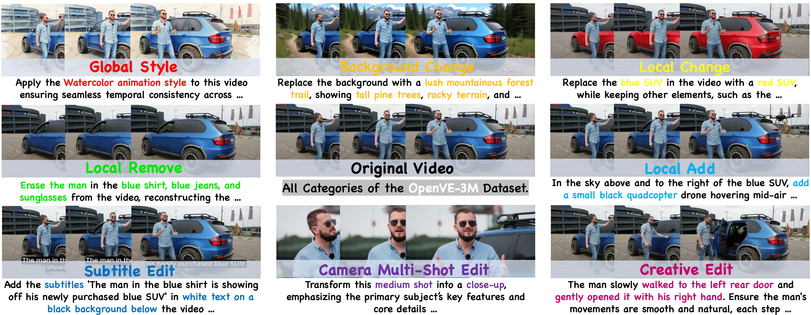

<div align="center">
  
</div>
<h1 align="center" style="line-height: 50px;">
  OpenVE-3M: A Large-Scale High-Quality Dataset for Instruction-Guided Video Editing
</h1>

<div align="center">

[Haoyang He<sup>1*</sup>](https://scholar.google.com/citations?hl=zh-CN&user=8NfQv1sAAAAJ),
Jie Wang<sup>2*</sup>,
[Jiangning Zhang<sup>1</sup>](https://zhangzjn.github.io),
[Zhucun Xue<sup>1</sup>](https://scholar.google.com/citations?user=m3KDreEAAAAJ&hl=en),

[Xingyuan Bu<sup>2</sup>](https://scholar.google.com/citations?hl=en&user=cqYaRhUAAAAJ&view_op=list_works),
[Qiangpeng Yang<sup>2</sup>](https://scholar.google.com/citations?user=vr9z1VQAAAAJ&hl=en&oi=ao),
[Shilei Wen<sup>2</sup>](https://scholar.google.com/citations?user=zKtYrHYAAAAJ&hl=en&oi=ao),
[Lei Xie<sup>1#</sup>](https://scholar.google.com/citations?hl=zh-CN&user=7ZZ_-m0AAAAJ),

<sup>1</sup>Zhejiang University, <sup>2</sup>Bytedance

\*Equal Contribution. \# Corresponding Author.
</div>

<div align="center">
  <a href="https://lewandofskee.github.io/projects/OpenVE/"></a> &ensp;
  <a href="https://arxiv.org/abs/2512.07826"></a> &ensp;
  <a href="https://www.modelscope.cn/models/"></a> &ensp;
  
  <a href="https://huggingface.co/Bytedance/OpenVE-Edit"></a> &ensp;
  <a href="https://huggingface.co/datasets/Lewandofski/OpenVE-3M"></a> &ensp;
  <a href="https://huggingface.co/datasets/Lewandofski/OpenVE-Bench"></a> &ensp;
</div>

---


## 📑 Open-Source Plan
The dataset, code, model, and benchmark are currently under review. Please stay tuned.
- [x] OpenVE-3M Dataset
- [ ] OpenVE-Edit Model
- [x] OpenVE-Bench Benchmark
- [ ] Inference & Multi-gpus Sequence Parallel inference
- [ ] Fine-tuning & Lora-tuning scripts


## 🌍  Introduction
The quality and diversity of instruction-based image editing datasets are continuously increasing, yet large-scale, high-quality datasets for instruction-based video editing remain scarce. To address this gap, we introduce OpenVE-3M, an open-source, large-scale, and high-quality dataset for instruction-based video editing. It comprises two primary categories: spatially-aligned edits (Global Style, Background Change, Local Change, Local Remove, Local Add, and Subtitles Edit) and non-spatially-aligned edits (Camera Multi-Shot Edit and Creative Edit). All edit types are generated via a meticulously designed data pipeline with rigorous quality filtering. OpenVE-3M surpasses existing open-source datasets in terms of scale, diversity of edit types, instruction length, and overall quality. Furthermore, to address the lack of a unified benchmark in the field, we construct OpenVE-Bench, containing 431 video-edit pairs that cover a diverse range of editing tasks with three key metrics highly aligned with human judgment. We present OpenVE-Edit, a 5B model trained on our dataset that demonstrates remarkable efficiency and effectiveness by setting a new state-of-the-art on OpenVE-Bench, outperforming all prior open-source models including a 14B baseline.
<!-- More details please refer to our [technical report](https://arxiv.org/abs/). -->
<div align="center">

<p><b>Demonstration of Eight different categories on the same video from the proposed OpenVE-3M dataset.</b></p>
</div>


## 🔗 Citation
If you find OpenVE useful for your research and applications, please cite using this BibTeX:
```
@article{he2025openve-3m,
      title={OpenVE-3M: A Large-Scale High-Quality Dataset for Instruction-Guided Video Editing}, 
      author={Haoyang He, Jie Wang, Jiangning Zhang, Zhucun Xue, Xingyuan Bu, Qiangpeng Yang, Shilei Wen, Lei Xie},
      journal={arXiv preprint arXiv:2512.07826},
      year={2025}
}
```
